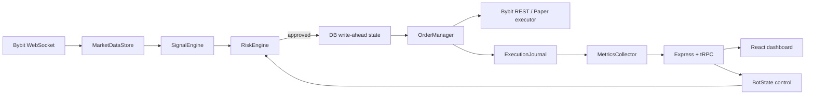

# Architecture

```mermaid
flowchart LR
  WS[Bybit WebSocket] --> Store[MarketDataStore]
  Store --> Signal[SignalEngine]
  Signal --> Risk[RiskEngine]
  Risk -->|approved| WAL[DB write-ahead state]
  WAL --> Orders[OrderManager]
  Orders --> REST[Bybit REST / Paper executor]
  Orders --> Journal[ExecutionJournal]
  Journal --> Metrics[MetricsCollector]
  Metrics --> API[Express + tRPC]
  API --> UI[React dashboard]
  API --> Control[BotState control]
  Control --> Risk
```

The engine and API communicate through PostgreSQL rather than process-local imports.
This keeps Railway services independently restartable and preserves audit history.
